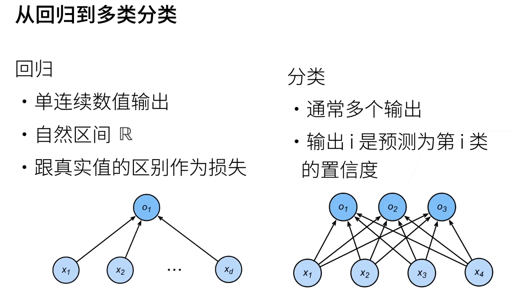
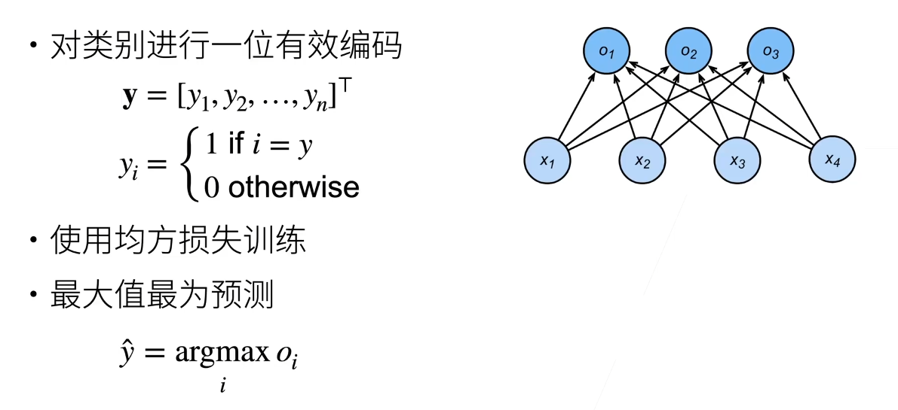
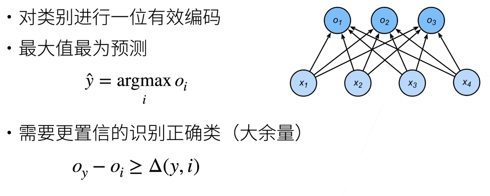
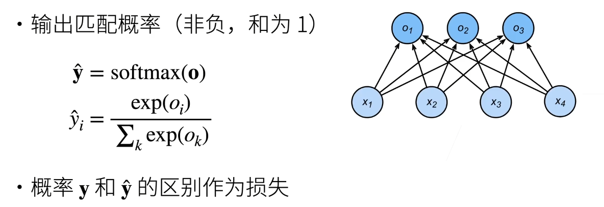
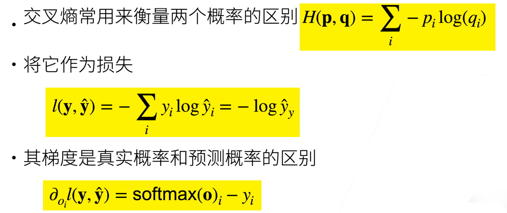
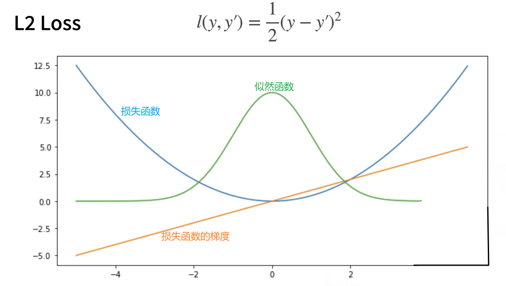
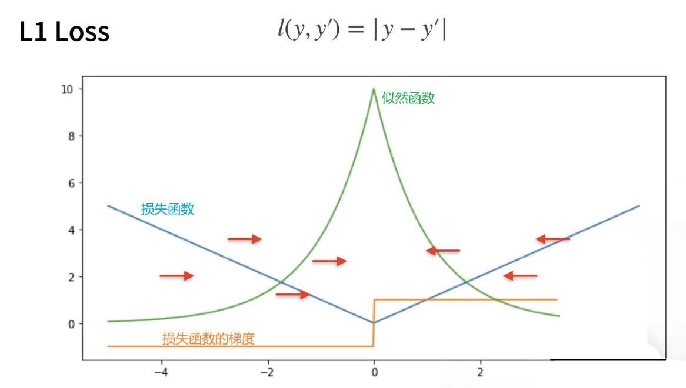
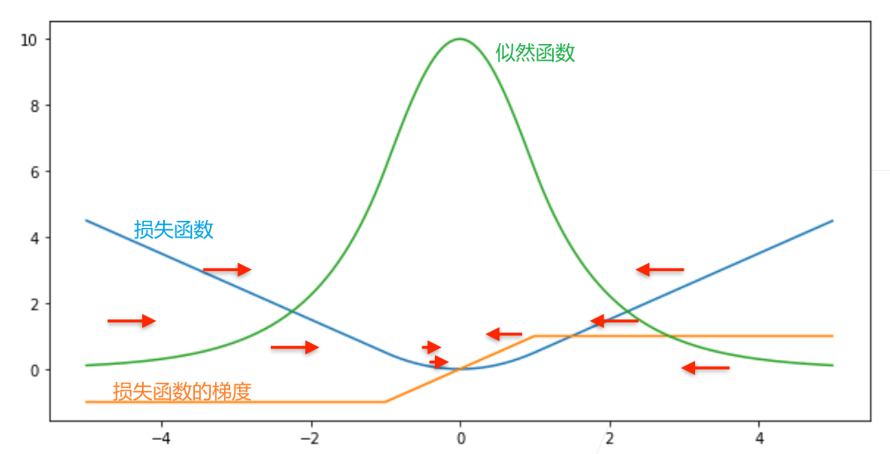

[TOC]

# 一、Softmax回归

> Softmax回归实际上是一个分类问题

## 1.1	回归 vs 分类

1. 回归：估计一个连续值
2. 分类：预测一个离散类别

## 1.2	从回归到多类分类

### 1.2.1	均方损失

### 1.2.2	无校验比例

### 1.2.3	校验比例

> 希望正确类的置信度更大，与其它类的差别更明显

## 1.3	Softmax和交叉熵损失

**交叉熵：**
$$
H(p,q)=\sum_i -p_i\log(q_i)
$$
**交叉熵损失：**
$$
loss(y,\hat{y})=-\sum_i y_i\log{\hat{y_i}}=-\log\hat{y_y}
$$

## 1.4	总结

1. Softmax回归是一个多分类模型
2. 使用Softmax操作得到每个类的预测置信度
3. 使用交叉熵来衡量预测与label的区别

# 二、损失函数

损失函数用于衡量预测值和真实值之间的区别

## 2.1	均方损失 L2 Loss

$$
loss(y,y')=\frac{1}{2}(y-y')^2
$$

## 2.2	绝对值损失 L1 Loss

$$
loss(y,y')=|y-y'|
$$

## 2.3	Huber's Robust Loss

$$
loss(y,y')=
\left\{
\begin{aligned}
|y-y'|-\frac{1}{2}     &\ \ \ \   if\ |y-y'|>1 \\
\frac{1}{2}(y-y')^2    &\ \ \ \   otherwise
\end{aligned}
\right.
$$

