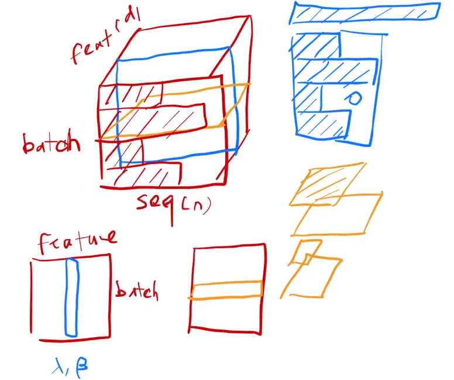

[TOC]

# 框架

# 一、任务

## 1.1	输入、输出

输入：$(x_1, ... x_n)$

输入的词向量表示：$(z_1,...z_n)$

1. $z_i$是$x_i$的词向量

输出：$(y_1,...,y_n)$

## 1.2	超参数

1. $N=6$：模块重复的次数
2. $d_{model}=512$：整个计算过程中，特征向量的维度
3. $d_{ff}=2048$：Feed Forward隐藏层的维度，即将特征向量先投影为$d_{ff}$维，然后再投影回$d_{model}$维
2. $h=8$：计算多头注意力时，将Q、K、V向低维投影的次数
2. $d_k=64$：计算多头注意力时，Q、K对应的低维向量维度，$h*d_k=d_{model}$
2. $d_v=64$：计算多头注意力时，V对应的低维向量维度，$h*d_v=d_{model}$
2. $P_{drop}=0.1$：丢弃的概率
2. $ε_{ls}=0.1$：做label smoothing时，label的真实值是多少，即置信度是多少是就认为正确
2. $train\ steps=100K$：训练的批次数

# 二、前置知识

## 2.1	Tensor

训练过程中的Tensor：三维向量

1. (**batch_size**，**seq(n)**，**feature**)

## 2.2	BatchNorm & LayerNorm

1. **归一化**：将序列的均值变为0，方差变为1
   1. 方法：将每个数据减去均值后除以方差
   2. 训练时使用单个batch的均值方差，预测时会使用全局的均值方差
2. **BatchNorm**：对每个特征做归一化
3. **LayerNorm**：对每个样本做归一化
4. 使用LayerNorm的优点：
   1. 避免了序列的长度不同对全局信息的影响，更加稳定

# 三、模型结构

## 3.1	注意力计算

1. **query**：一个向量，长度为$d_k$
2. **key**：一个向量，长度为$d_k$
3. **value**：一个向量，长度为$d_v$
4. **output**：是value的加权和，长度为$d_v$
   1. 权重是通过key和query的相似度计算得来的
   2. 相似度计算：**query · key^T^**

**Scaled Dot-Product Attention**

1. n个query组成了矩阵$Q_{n×d_k}$，m个key组成了矩阵$K_{m×d_k}$
2. 两个矩阵相乘得到相似度$\frac{Q·K^T}{\sqrt{d_k}}$，然后对每一行做softmax得到权重
3. 最后乘$V$，得到注意力$Attention_{n×d_v}$

$$
Attention(Q,K,V)=softmax(\frac{QK^T}{\sqrt{d_k}})V
$$

## 3.2	多头注意力层

**mask**：目的——避免t时间看到以后时间的东西

1. 假设query和key的长度均为n，且在时间上一一对应，则对于t时间的query，它只应该看$k_1,...k_{t-1}$
2. 计算的时候可以算，但是在输出权重的时候，要通过mask，对于$q_t$和$k_t$之后的值更换为$-inf$，$-inf$经过softmax层后会变为0，从而实现$k_t,...k_n$对应的权重均为0

**multi-head attention**：目的——对于不同的序列，让网络能够实现不同的识别模式

1. 将Q、K、V投影到低维，一共投影h次
2. 在低维空间中进行h次注意力计算，然后再将h个计算结果拼接到一起
3. 最后将拼接后的向量重新投影回原始通道，得到最终的输出
4. 在整个过程中，投影的权重是可以学习的，通过不同的投影方式，体现不同的识别模式

$$
MultiHead(Q,K,V)=concat(head_1,...head_h)W\\
head_i=Attention(QW_i^Q, KW_i^K, VW_i^V)
$$

## 3.3	Transformer中的多头注意力

Attention的作用：对序列信息做一次汇聚，抓取出感兴趣的东西

### 3.3.1	编码器：自注意力

输入：设句子的长度为$n$，则输入为$n$个长度为$d$的向量

计算自注意力：

1. 输入序列同时是Q、K、V
2. 输出是输入的加权和，权重来自于输入本身
3. 由于多头注意力机制，会学出h个不同距离空间

### 3.3.2	解码器：自注意力

输入：设句子的长度为$m$，则输入为$m$个长度为$d$的向量

计算自注意力：

1. 输入序列同时是Q、K、V
2. 输出是输入的加权和，权重来自于输入本身
3. 由于多头注意力机制，会学出h个不同距离空间

### 3.3.3	解码器：注意力

计算注意力：

1. Encoder的输出作为K、V，Decoder上一层的输出作为Q
2. 意味着解码器的每一个输出作为query，算一个输出，也就是把编码器的输出，根据想要的东西，将它拎出来
3. 例如：英翻中，英文为`hello world`，则对应的中文为`你好，世界`
   1. 在已经输出`你`，想要得到`好`的时候，看Encoder的输出，应该距离`hello`的向量更近一点
   2. 而在已经输出`你好`，想要得到`世`的时候，看Encoder的输出，应该距离`world`的向量更近一点
   3. 也就是说，根据解码器输入的不一样，在编码器的输出里面去挑感兴趣的东西，也就是注意到感兴趣的东西

## 3.4	Position-wise Feed-Forward Networks

实际上是一个单隐藏层的MLP，但是会对每一个词向量做一次投影，也就是对输入的最后一维做投影操作

1. $x$：512维的向量
2. $W_1$：将$x$投影为2048维向量
3. $W_2$：再将结果投影回512维
4. 由于在之前通过Attention已经将序列信息汇聚起来，因此可以对每一个词都分别进行相同的MLP操作

## 3.5	Embedding

1. 对于任何一个词，学习一个长为$d_{model}$来表示它
2. 在embedding时，会将权重乘一个$\sqrt{d_{model}}$，从而让词向量与后续计算位置编码时，两者的scale相同

## 3.6	Positional Encoding

由于Attention没有时序信息，因此需要添加一个位置编码，表示时序信息
$$
\begin{aligned}
PE[pos][2i]&=sin(\frac{pos}{10000^{2i/d_{model}}}) \\
PE[pos][2i+1]&=cos(\frac{pos}{10000^{2i/d_{model}}})
\end{aligned}
$$
